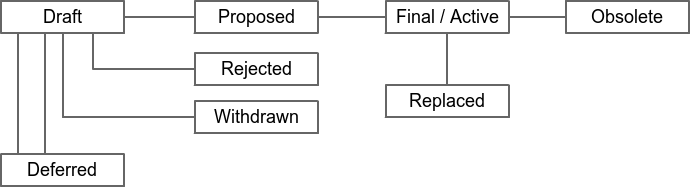

```
bLIP: 1
Title: bLIP process
Status: Active
Author: Ryan Gentry <ryan@lightning.engineering>
Created: 2021-05-21
Post-History: 2021-06-30: https://lists.linuxfoundation.org/pipermail/lightning-dev/2021-June/003086.html
  [lightning-dev] bLIPs: A proposal for community-driven app layer and protocol extension standardization
License: CC0
```

# Abstract

bLIP stands for Bitcoin Lightning Improvement Proposal. A bLIP is a design document 
providing information to the Lightning community, or describing a new feature for 
the Lightning Network. The bLIP should provide a concise technical specification of 
the feature and a rationale for the feature. The bLIP author is responsible for 
building consensus within the community and documenting dissenting opinions.

# Copyright

This bLIP is licensed under the CC0 license.

# Rationale

As the Lightning community has grown, new features, standards, and protocols have 
been developed outside of the BOLT specification process: particularly at the 
application level that isn’t described within the core BOLT documents. This is great! 
But in the spirit of interoperability, documenting features, standards, and protocols 
in a single location with a standard format will make it easy on future adopters. 

In particular, there are three scarce sets of identifiers used in Lightning Network
protocol development that benefit from central organization and documentation to
avoid potential clashes:

* **Feature Bits** are used to designate that a given node supports a given feature, and 
are publicly broadcasted on the Lightning Network. Feature Bits are first introduced as
optional with *odd* bits, and when upgraded to compulsory are switched to *even* bits, 
so a new feature proposed in a bLIP should start with an *odd* bit. Feature Bits are 
assigned and specified in [Bolt
 #9](https://github.com/lightningnetwork/lightning-rfc/blob/master/09-features.md).
* **Message Types** are used to indicate how to interpret the `payload` feature of a 
Lightning message. Types `32768`-`65535` are set aside for experimental and 
application-specific messages, which are best suited to be documented in a bLIP. 
Message Types are assigned and specified in [Bolt
 #1](https://github.com/lightningnetwork/lightning-rfc/blob/master/01-messaging.md).
* **Type-Length-Values (TLVs)** are used to allow for the backwards-compatible addition 
of new fields to existing message types. `type` determines how the contents of `value`
should be decoded, so specifying how to actually perform that decoding is a
great use case for a bLIP. TLVs are not assigned anywhere, but specified in [Bolt
 #1](https://github.com/lightningnetwork/lightning-rfc/blob/master/01-messaging.md).

bLIPs will serve as the primary mechanism for proposing new features for the Lightning 
Network protocol, documenting their design, and avoiding collisions of these scarce 
identifiers (as some proposals may request one or more). Hopefully, they will provide 
an avenue for developers to quickly get feedback on their ideas outside of the main BOLT 
process. Because the bLIPs are maintained as text files in a versioned repository, 
their revision history is the historical record of the feature proposal.

It is highly recommended that a single bLIP contain a single key proposal or new idea. 
More focused bLIPs will tend to be more successful. If in doubt, a bLIP should be 
split into several well-focused ones.

For Lightning developers, bLIPs are a convenient way to track the progress of their 
implementation. Ideally, each implementation editor would list the bLIPs they have 
implemented. This will give end users a convenient way to know the current status of 
a given implementation or library.

# bLIP Workflow

The bLIP process begins with a new idea for Lightning. Each potential bLIP must have 
a champion -- someone who writes the bLIP using the style and format described below, 
shepherds the discussions in the appropriate forums, and attempts to build community 
consensus around the idea. The bLIP champion (a.k.a. Author) should first attempt to 
ascertain whether the idea is bLIP-able. The first step should be to search past 
discussions to see if an idea has been considered before, and if so, what issues arose 
in its progression. Such discussion generally happens on the [Lightning development 
mailing list](https://lists.linuxfoundation.org/mailman/listinfo/lightning-dev), or 
in the #lightning-dev IRC channel.

Once the champion has asked the Lightning community as to whether an idea has any 
chance of acceptance, a draft bLIP should be presented to the [Lightning development 
mailing list](https://lists.linuxfoundation.org/mailman/listinfo/lightning-dev). This 
gives the author a chance to flesh out the draft bLIP to make it properly formatted, 
of high quality, and to address additional concerns about the proposal. Following a 
discussion, the proposal should be submitted to the [bLIPs folder of the lightning-rfc
repository](https://github.com/lightningnetwork/lightning-rfc) as a pull request. This 
draft must be written in bLIP style as described below, and its bLIP number will be 
the PR number automatically assigned by Github (or, if preferred by the author, the 
Issue # if there was discussion in the Issues section of this repository about this bLIP).

When the bLIP draft is complete, the lightning-rfc editors will check the requested 
Feature Bit, Message Type, and/or TLV assignments for collisions. If there are no 
issues, the lightning-rfc editors will merge the pull request into the [bLIPs folder 
of the lightning-rfc repository](https://github.com/lightningnetwork/lightning-rfc). 
The editors will not unreasonably reject a bLIP. Reasons for rejecting bLIPs include 
duplication of effort, disregard for formatting rules, being too unfocused or too 
broad, being technically unsound, not providing proper motivation or addressing 
backwards compatibility, or not in keeping with the Bitcoin and Lightning Network 
philosophy. For a bLIP to be accepted it must meet certain minimum criteria. It 
must be a clear and complete description of the proposed enhancement. The enhancement must 
represent a net improvement. The proposed implementation, if applicable, must be solid 
and must not complicate the protocol unduly.

The bLIP author may update the draft as necessary in the git repository. Updates to 
drafts should also be submitted by the author as pull requests.

## Transferring bLIP Ownership

It occasionally becomes necessary to transfer ownership of bLIPs to a new champion. In 
general, we'd like to retain the original author as a co-author of the transferred bLIP, 
but that's really up to the original author. A good reason to transfer ownership is 
because the original author no longer has the time or interest in updating it or 
following through with the bLIP process, or has fallen off the face of the 'net (i.e. is 
unreachable or not responding to email). A bad reason to transfer ownership is because 
you don't agree with the direction of the bLIP. We try to build consensus around a bLIP, 
but if that's not possible, you can always submit a competing bLIP.

If you are interested in assuming ownership of a bLIP, send a message asking to take over, 
addressed to both the original author and the bLIP editor. If the original author doesn't 
respond to email in a timely manner, the bLIP editor will make a unilateral decision (it's 
not like such decisions can't be reversed).

### bLIP Editors

The current BOLT editors are the bLIP editors.

### bLIP Editor Responsibilities & Workflow

For each new bLIP submission, the editors do the following:

* Read the bLIP to check if it is ready: sound and complete. The ideas must make technical 
sense, even if they don't seem likely to get to final status.
* The title should accurately describe the content.
* The bLIP draft must have been sent to the lightning-dev mailing list for discussion.
* Motivation and backward compatibility (when applicable) must be addressed.
* Licensing terms must be acceptable for bLIPs.

If the bLIP isn't ready, the editor will send it back to the author for revision, with 
specific instructions.

Once the bLIP is ready for the repository, the bLIP editor will:

* Assign a bLIP number (generally the PR number or, if preferred by the author, the Issue # 
if there was discussion in the Issues section of this repository about this bLIP)
* Check the requested Feature Bit, Message Type, and/or TLV assignments for collisions.
* Merge the corresponding pull request
* Send a message back to the bLIP author with the next steps.

The bLIP editors are intended to fulfill administrative and editorial responsibilities. 
They do not pass judgement on bLIPs. The bLIP editors monitor bLIP changes, and update bLIP 
headers as appropriate.

## What belongs in a successful bLIP?

bLIPs should be written in Markdown format.

Each bLIP should have the following parts:

* **Preamble** -- Headers containing metadata about the bLIP (see below).
* **Abstract** -- A short (~200 word) description of the technical issue being addressed.
* **Copyright** -- The bLIP must be explicitly licensed under acceptable copyright terms (see below).
* **Specification** -- The technical specification should describe the syntax and semantics 
of any new feature. The specification should be detailed enough to allow competing, 
interoperable implementations for any of the current Lightning implementations.
* **Motivation** -- The motivation is critical for bLIPs that want to change the Lightning 
protocol. It should clearly explain why the existing protocol is inadequate to address 
the problem that the bLIP solves.
* **Rationale** -- The rationale fleshes out the specification by describing what motivated 
the design and why particular design decisions were made. It should describe alternate 
designs that were considered and related work. The rationale should provide evidence of 
consensus within the community and discuss important objections or concerns raised 
during discussion.
* **Backwards Compatibility** -- All bLIPs that introduce backwards incompatibilities must 
include a section describing these incompatibilities and their severity. The bLIP must 
explain how the author proposes to deal with these incompatibilities.
* **Reference Implementation** -- The reference implementation must be completed before any 
bLIP is given status "Final", but it need not be completed before the bLIP is accepted. It 
is better to finish the specification and rationale first and reach consensus on it before 
writing code. The final implementation must include test code and documentation appropriate 
for the Lightning protocol.

### bLIP Header Preamble

Each bLIP must begin with an RFC 822 style header preamble. The headers must appear in the 
following order. Headers marked with "*" are optional and are described below. All other 
headers are required.

```
bLIP: bLIP number, this is determined by the PR or Issue number 
Title: bLIP title
Author: list of the author's or authors' name(s) and/or username(s), or name(s) and 
email(s). Details are below.
* Discussions-To: a url pointing to the official discussions thread
Status: Draft, Active, Proposed, Deferred, Rejected, Withdrawn, Final, Replaced, Obsolete
Created: date created on, in ISO 8601 (yyyy-mm-dd) format
* Post-History: dates of postings to lightning-dev mailing list, or link to thread in 
  mailing list archive
License: abbreviation for approved license(s)
* License-Code: abbreviation for code under different approved license(s)
* Requires: bLIP number(s)
* Replaces: bLIP number
* Superseded-By: bLIP number
```

The Author header lists the names and email addresses of all the authors/owners of the bLIP. 
The format of the Author header value must be:

`Random J. User <address@dom.ain>`

If there are multiple authors, each should be on a separate line following RFC 2822 
continuation line conventions.

While a bLIP is in private discussions (usually during the initial Draft phase), a 
Discussions-To header will indicate the mailing list or URL where the bLIP is being discussed. 
No Discussions-To header is necessary if the bLIP is being discussed privately with the author, 
or on the bitcoin email mailing lists.

The Created header records the date that the bLIP was assigned a number, while Post-History 
is used to record when new versions of the bLIP are posted to bitcoin mailing lists. Dates 
should be in yyyy-mm-dd format, e.g. 2001-08-14. Post-History is permitted to be a link to a 
specific thread in a mailing list archive.

bLIPs may have a Requires header, indicating the bLIP numbers that this bLIP depends on.

bLIPs may also have a Superseded-By header indicating that a bLIP has been rendered 
obsolete by a later document; the value is the number of the bLIP that replaces the 
current document. The newer bLIP must have a Replaces header containing the number of the 
bLIP that it rendered obsolete.

### bLIP status field

The typical paths of the status of bLIPs are as follows:



* **Draft** - The first formally tracked stage of a bLIP in development. A bLIP is merged by 
a bLIP Editor into the proposals folder of the lightning-rfc repository when properly formatted.

* **Deferred** - The bLIP editor may also change the status to Deferred when no progress is being 
made on the bLIP.

* **Withdrawn** - Champions of a bLIP may decide on their own to change the status between Draft, 
Deferred, or Withdrawn.

* **Rejected** - bLIPs should be changed from Draft status to Rejected status, upon request by any 
person, if they have not made progress in three years. Such a bLIP may be changed to Draft 
status if the champion provides revisions that meaningfully address public criticism of the 
proposal, or to Proposed status if it meets the criteria required as described in the previous 
paragraph.

* **Proposed** - a bLIP may only change status from Draft (or Rejected) to Proposed, when the author 
deems it is complete, has a working implementation (where applicable), and has community plans 
to progress it to the Final status.

* **Final / Active** - a Proposed bLIP may progress to Final only when specific criteria reflecting 
real-world adoption has occurred. This is different for each bLIP depending on the nature of 
its proposed changes, which will be expanded on below. Evaluation of this status change should 
be objectively verifiable, and/or be discussed on the development mailing list. A bLIP may change 
status from Draft to Active when it achieves rough consensus on the mailing list. Such a proposal 
is said to have rough consensus if it has been open to discussion on the development mailing list 
for at least one month, and no person maintains any unaddressed substantiated objections to it. 
Addressed or obstructive objections may be ignored/overruled by general agreement that they have 
been sufficiently addressed, but clear reasoning must be given in such circumstances.

* **Replaced or Obsolete** - when a Final bLIP is no longer relevant, its status may be changed to
Replaced or Obsolete (which is equivalent to Replaced). This change must also be objectively 
verifiable and/or discussed.

### Auxiliary Files

bLIPs may include auxiliary files such as diagrams. Auxiliary files should be included in a 
subdirectory for that bLIP, or must be named bLIP-XXXX-Y.ext, where "XXXX" is the bLIP number, 
"Y" is a serial number (starting at 1), and "ext" is replaced by the actual file extension 
(e.g. "png").

## Licensing

All bLIPs must be licensed under CC-BY or CC0.

# History

This document was derived heavily from [Bitcoin's
 BIP-0002](https://github.com/bitcoin/bips/blob/master/bip-0002.mediawiki) written by Luke Jr. 
which in turn was derived from [Python's PEP-0001](https://www.python.org/dev/peps/). In many 
places text was simply copied and modified. Although the PEP-0001 text was written by Barry 
Warsaw, Jeremy Hylton, and David Goodger, they are not responsible for its use in the 
Bitcoin Lightning Improvement Process, and should not be bothered with technical questions 
specific to the Lightning Network or the bLIP. Please direct all comments to the bLIP editors.
