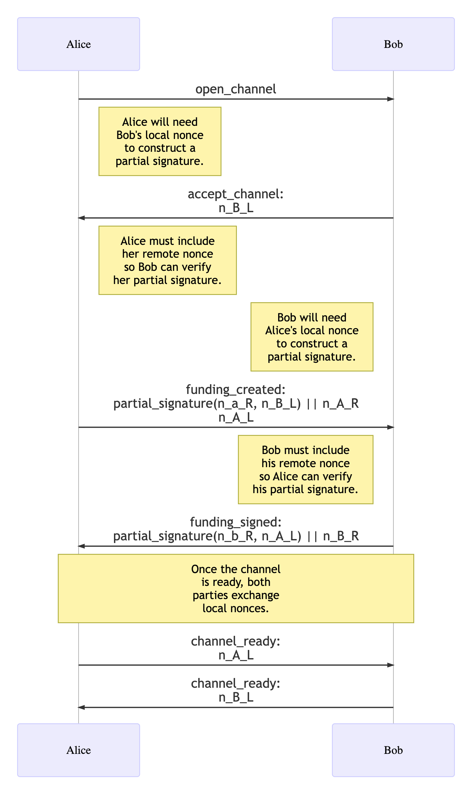
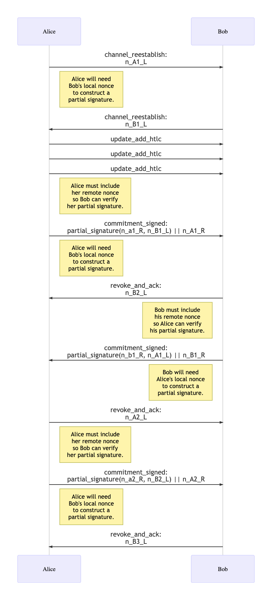

# Extension BOLT XX: Simple Taproot Channels

Authors:
  * Olaoluwa Osuntokun <roasbeef@lightning.engineering>
  * Eugene Siegel <eugene@lightning.engineering>

Created: 2022-04-20

# Table of Contents

- [Introduction](#introduction)
  * [Abstract](#abstract)
  * [Motivation](#motivation)
  * [Preliminaries](#preliminaries)
    + [Pay-To-Taproot-Outputs](#pay-to-taproot-outputs)
      - [Tapscript Tree Semantics](#tapscript-tree-semantics)
      - [BIP 86](#bip-86)
      - [Taproot Key Path Spends](#taproot-key-path-spends)
      - [Taproot Script Path Spends](#taproot-script-path-spends)
    + [MuSig2 & Associated Changes](#musig2--associated-changes)
      - [Key Aggregation](#key-aggregation)
      - [Nonce Generation](#nonce-generation)
      - [Nonce Handling](#nonce-handling)
      - [Signing](#signing)
    + [Nothing Up My Sleeves Points](#nothing-up-my-sleeves-points)
  * [Design Overview](#design-overview)
  * [Specification](#specification)
    + [Feature Bits](#feature-bits)
    + [New TLV Types](#new-tlv-types)
    + [Channel Funding](#channel-funding)
      - [`open_channel` Extensions](#open_channel-extensions)
      - [`accept_channel` Extensions](#accept_channel-extensions)
      - [`funding_created` Extensions](#funding_created-extensions)
      - [`funding_signed` Extensions](#funding_signed-extensions)
      - [`channel_ready` Extensions](#channel_ready-extensions)
    + [Cooperative Closure](#cooperative-closure)
      - [`shutdown` Extensions](#shutdown-extensions)
      - [`closing_signed` Extensions](#closing_signed-extensions)
    + [RBF Cooperative Close Extensions](#rbf-cooperative-close-extensions)
      - [New TLV Types for RBF Cooperative Close](#new-tlv-types-for-rbf-cooperative-close)
      - [`closing_complete` Extensions](#closing_complete-extensions)
      - [`closing_sig` Extensions](#closing_sig-extensions)
      - [RBF Nonce Rotation Protocol](#rbf-nonce-rotation-protocol)
    + [Channel Operation](#channel-operation)
      - [`commitment_signed` Extensions](#commitment_signed-extensions)
      - [`revoke_and_ack` Extensions](#revoke_and_ack-extensions)
    + [Message Retransmission](#message-retransmission)
      - [`channel_reestablish` Extensions](#channel_reestablish-extensions)
    + [Funding Transactions](#funding-transactions)
    + [Commitment Transactions](#commitment-transactions)
      - [To Local Outputs](#to-local-outputs)
      - [To Remote Outputs](#to-remote-outputs)
      - [Anchor Outputs](#anchor-outputs)
    + [HTLC Scripts & Transactions](#htlc-scripts--transactions)
      - [Offered HTLCs](#offered-htlcs)
      - [Accepted HTLCs](#accepted-htlcs)
      - [HTLC Second Level Transactions](#htlc-second-level-transactions)
        * [HTLC-Success Transactions](#htlc-success-transactions)
        * [HTLC-Timeout Transactions](#htlc-timeout-transactions)
- [Appendix](#appendix)
- [Footnotes](#footnotes)
- [Test Vectors](#test-vectors)
- [Acknowledgements](#acknowledgements)

# Introduction

## Abstract


The activation of the Taproot soft-fork suite enables a number of updates to
the Lightning Network, allowing developers to improve the privacy, security,
and flexibility of the system. This document specifies extensions to BOLTs 2,
3, and 5 which describe new, Taproot based channels to update to the Lightning
Network to take advantage of _some_ of these new capabilities. Namely, we
mechanically translate the current funding and commitment design to utilize
`musig2` and the new tapscript tree capabilities.

## Motivation

The activation of Taproot grants protocol developers with a number of new tools
including: schnorr, musig2, scriptless scripts, PTLCs, merkalized script trees
and more. While it's technically possible to craft a _single_ update to the
Lightning Network to take advantage of _all_ these new capabilities, we instead
propose a step-wise update process, with each step layering on top of the prior
with new capabilities. While the ultimate realization of a more advanced
protocol may be delayed as a result of this approach, packing up smaller
incremental updates will be easier to implement and review, and may also
hasten the timeline to deploy initial taproot based channels.

In this document, we start by revising the most fundamental component of a
Lightning Channel: the funding output. By first porting the funding output to
Segwit V1 (P2TR) `musig2` based output, we're able to re-anchor all channels in
the network with the help of dynamic commitments. Once those channels are
re-anchored, dynamic commitments allows developers to ship incremental changes
to the commitment transaction, HTLC structure, and overall channel structure --
all without additional on-chain transactions.

By restricting the surface area of the _initial_ update, we aim to expedite the
initial roll-out while also providing a solid base for future updates without
blocking off any interesting design paths. Implementing and shipping a
constrained update also gives implementers an opportunity to get more familiar
with the new tooling and capabilities, before tackling more advanced protocol
designs.

## Preliminaries

In this section we lay out some preliminary concepts, protocol flows, and
notation that'll be used later in the core channel specification.

### Pay-To-Taproot-Outputs

The Taproot soft fork package (BIPs
[340](https://github.com/bitcoin/bips/blob/master/bip-0340.mediawiki),
[341](https://github.com/bitcoin/bips/blob/master/bip-0341.mediawiki), and
[342](https://github.com/bitcoin/bips/blob/master/bip-0342.mediawiki))
introduced a new
[Segwit](https://github.com/bitcoin/bips/blob/master/bip-0141.mediawiki)
witness version: v1. This new witness version utilizes a new standardized
public key script template:
```
OP_1 <taproot_output_key>
```

The `taproot_output_key` is a 32-byte x-only `secp256k1` public key, with all
digital signatures based off of the schnorr signature scheme described in [BIP
340](https://github.com/bitcoin/bips/blob/master/bip-0340.mediawiki).

A `taproot_output_key` commits to an internal key, and optional script root via
the following mapping:
```
taproot_output_key = taproot_internal_key + tagged_hash("TapTweak", taproot_internal_key || script_root)*G
```

It's important to note that while `taproot_output_key` is serialized as a
32-byte public key, in order to properly spend the script path, the parity
(even or odd) of the output public key must be remembered.

The `taproot_internal_key` is also a BIP 340 public key, ideally derived anew
for each output. The `tagged_hash` scheme is described in BIP 340, we briefly
define the function as:
```
tagged_hash(tag, msg) = SHA256(SHA256(tag) || SHA256(tag) || msg)
```

#### Tapscript Tree Semantics

The `script_root` is the root of a Tapscript tree as defined in BIP 341. A tree
is composed of `tap_leaves` and `tap_branches`.

A `tap_leaf` is a two tuple of (`leaf_version`, `leaf_script`). A `tap_leaf` is serialized as:
```
leaf_version || compact_size_of(leaf_script) || leaf_script
```
where `compact_size_of` is the variable length integer used in the Bitcoin P2P
protocol.

The digest of a `tap_leaf` is computed as:
```
tagged_hash("TapLeaf", leaf_encoding)
```

where `leaf_encoding` is serialized as: 
```
leaf_version || compact_size_of(leaf_script) || leaf_script
```

A `tap_branch` can commit to either a `tap_leaf` or `tap_branch`. Before
hashing, a `tap_branch` sorts the two `tap_node` arguments based on
lexicographical ordering:
```
tagged_hash("TapBranch", sort(node_1, node_2))
```

A tapscript tree is constructed by hashing each pair of leaves into a
`tap_branch`, then combining these branches with each other until only a single
hash remains. There're no strict requirements at the consensus level for tree
construction, allowing systems to "weight" the tree by placing items that occur
more often at the top of the tree. A simple algorithm that attempts to [produce
a balanced script tree can be found here](https://github.com/btcsuite/btcd/blob/99e4e00345017a70eadc4e1d06353c56b23bb15c/txscript/taproot.go#L618-L776).

#### BIP 86

A `taproot_output_key` doesn't necessarily _need_ to commit to a `script_root`,
unless the `script_root` is being revealed, a normal key (skipping the tweaking
operation) can be used. In many cases it's also nice to prove to a 3rd party
that the output can only be spent with a top-level signature and not also a
script path.

[BIP 86](https://github.com/bitcoin/bips/blob/master/bip-0086.mediawiki)
defines a taproot output key derivation scheme, wherein only the internal key
is committed to without a script root:
```
taproot_output_key = taproot_internal_key + tagged_hash("TapTweak", taproot_internal_key)*G
```

We use BIP 86 whenever we want to ensure that a script path spend isn't
possible, and an output can only be spent via a key path.

We recommend that in any instances where a normal unencumbered output is used
(cooperative closures, etc) BIP 86 is used as well.

#### Taproot Key Path Spends

A taproot key path spend a transaction to spend a taproot output without
revealing the script root, which may or may not exist.

The witness of a keypath spend is simply a 64 or 65 byte schnorr signature. A
signature is 64 bytes if the new `SIGHASH_DEFAULT` alias for `SIGHASH_ALL` is
being used. Otherwise a single byte for the sighash type is used as normal:
```
<key_path_sig>
```

If an output commits to a script root (or uses BIP 86), a private key will need
to be tweaked in order to generate a valid signature, and negated if the
resulting output key has an odd y coordinate (see BIP 341 for details).

For any revocation path based on a key spend (the HTLC revocation paths), the
tap tweak value MUST be known in order to spend the out unilaterally. As a
result, it's recommend that for a given revoked state, the tap tweak value is
also stored.

#### Taproot Script Path Spends

A script path spend is executed when a tapscript leaf is revealed. A script
path spends has three components: a control block, the script leaf being
revealed, and the valid witness.

A control block has the following serialization:
```
(output_key_y_parity | leaf_version) || internal_key || inclusion_proof
```

The first segment uses a spare bit of the `leaf_version` to encode the parity
of the output key, which is checked during control block verification. The
`internal_key` is just that. The `inclusion_proof` is the series of sibling
hashes in the path from the revealed leaf all the way up to the root of the
tree. In practice, if one hashes the revealed leaf, and each 32-byte hash of the
inclusion proof together, they'll reach the script root if the proof was valid.

If only a single leaf is committed to in a tree, then the `inclusion_proof`
will be absent.

The final witness stack to spend a script path output is:
```
<witness1> ... <witnessN> <leaf_script> <control_block>
```

Note that whenever a script path spend is required, in order to ensure an
output is unilaterally spendable by a party, the finalized control block MUST
either be stored as is, or the components needed to reconstruct the control
block are persisted.

#### SIGHASH_ALL vs SIGHASH_DEFAULT

Where ever applicable, signers SHOULD use the `SIGHASH_DEFAULT` sighash over
`SIGHASH_ALL`. When using taproot semantics, both algorithm refer to the very
same digest, but `SIGHASH_DEFAULT` allows us to save a byte for any signature,
as omitting the explicit sighash byte denotes that the default signing
algorithm was used.

### MuSig2 & Associated Changes

Musig2 is a multi-signature scheme based on schnorr signatures. It allows N
parties to construct an aggregated public key, and then generate a single
multi-signature that can only be generated with all the parties of the
aggregated key. In practice, we use this to allow the funding output of
channel to look just like any other P2TR output.

A musig2 signing flow has 4 stages:

  1. First, each party generates a public nonce, and exchanges it with every
    other party.

  2. Next, public keys are exchanged by each party, and combined into a single
    aggregated public key.

  3. Next, each party generates a _partial_ signature and exchanges it with
    every other party.

  4. Finally, once all partial signatures are known, they can be combined into a
    valid schnorr Signature, which can be verified using BIP 340.

Steps 1&2 may be performed out of order, or concurrently. In our case only two
parties exist, so as soon as one party knows both partial signatures, they can
be combined into a final signature.

Thought this document `musig2` refers to the finalized (v1.0.0)
[BIP-0327](https://github.com/bitcoin/bips/blob/master/bip-0327.mediawiki
specification.

#### Key Aggregation

We refer to the algorithm of `KeyAgg` algorithm [bip-musig2
v1.0.0](https://github.com/bitcoin/bips/blob/master/bip-0327.mediawiki) for key
aggregation. In order to avoid sending extra ordering information, we always
assume that both keys are sorted first with the `KeySort` algorithm before
aggregating (`KeyAgg(KeySort(p1, p2))`).

#### Nonce Generation

A `musig2` secret nonce is the concatenation of two random, 32-byte integers.

A `musig2` public nonce is technically the concatenation of two public keys,
each representing the EC-point corresponding to its secret integer, thus
resulting in a 66-byte value:

```
point_1 || point_2
```

For nonce generation, we refer to the `NonceGen` algorithm defined in the
`musig2` BIP. We only specify the set of required arguments, though a signer
can also opt to specify the additional argument, in order to strengthen their
nonce.

##### Counter Based Nonce Generation & JIT Nonce Strengthening 

Each new commitment state requires fresh nonces from both parties, as each
commitment state is signed using a fresh musig2 session. Nonces sent by either
party in the `commitment_signed` message can be generated Just-In-Time (JIT),
thus requiring no additional state. These nonces can also be further
strengthened by mixing in the commitment sighash information into the nonce
generation algorithm. 

Upon channel creation, and subsequent re-establishment, a fresh set of
verification nonces are exchanged by each party. This is the nonce the party
will use to _verify_ a new incoming commitment state sent by the remote party.
In order to force close a channel, the holder of a verification nonce must use
that same nonce to counter sign the commitment transaction with the other half
of the musig2 partial signature. Rather than force an implementation to retain
additional signing state (the verification nonce) to avoid holding a "hot"
(fully broadcast able) commitment on disk, we instead recommend a counter based
approach.

In this scenario are nonce generated via a counter is deemed to be safe as:

  1. Each commitment state only has a single signature exchanged to counter
     sign the commitment transaction.

  2. Each commitment state has a unique number which is currently encoded as a
     48-bit integer across the sequence and lock time of the commitment
     transaction. 

  3. The shachain scheme is used today to generate a fresh nonce-like value for
     the revocation scheme of today's penalty based channels.

  4. A verification nonce is only used to _sign_ a local party's commitment
     transaction when they go to broadcast a force close transaction.

  5. The remote party never sees the unaggregated partial signature the local
     party will use to broadcast, only the aggregated signature is seen on chain.

  6. As a result of all the above, a verification nonce will never be used to
     sign the exact same commitment transaction, thereby avoiding nonce reuse.

As a result, we recommend the following counter based scheme to generate
verification nonce. With this scheme, signing can remain stateless, as given
the commitment height/number of the state to sign, and the original shachain
root, the verification nonce sent by that state can be deterministically
reproduced:  

  1. Given the shachain root used to generate revocation pre-images,
     `shachain_root`, derive the `sha256` hash of this value as:
     `shachain_root_hash = sha256(shachain_root)`.

  2. Derive a _new_ shachain root to be used to generate `musig2` secret nonces
     via a `HMAC` invocation as: `musig2_shachain_root = hmac(msg,
     shachain_root_hash)`, where `msg` is any string that can serve to uniquely
     bind the produced secret to this dedicated context. A recommend value is
     the ASCII string `taproot-rev-root`.

  3. Given a commitment height/number (`N`), the verification nonce to send to
     the remote party party can be derived by obtaining the `Nth` shachain leaf
     preimage `k_i`. The verification nonce to be derived by calling the
     `musig2.NonceGen` algorithm with the required values, and the `rand'`
     value set to `k_i`.


#### Nonce Handling

For commitment transactions, Due to the asymmetric state of the current
revocation channels, two sets of public nonces need to be exchanged by each
party: one for the local commitment, and one for the remote commitment.

The nonce for the local commitment MUST be sent a priori, thus enabling the
counterparty to create a valid partial signature.

The nonce for the remote commitment _could_ be sent a priori, too, but for the
purposes of simplicity and disambiguation, MUST be sent alongside the partial
signature. To that end, we will create a new data type that will be reused in
multiple TLV extensions described further down in this document.

The exception to this is the co-op close flow: as there's only a single message
to sign, we only require a single pair of nonces. These nonces can also be sent
right as the co-op flow begins.

Note that if nonces for commitment updates are not generated using the counter
based scheme described above, then the nonces MUST be persisted to disk. As a
result, in order to minimize additional signing state, it is recommended that
the shachain counter nonce scheme is used.

#### Nonce Terminology

At all times, there exist _two_ nonces associated with a given commitment
state: the signing nonce, and the verification nonce. 

A peer's signing nonce is used to generate new commitments for the remote
party.  Each time a party signs a commitment, they send another signing nonce
to the remote party.

A peer's verification nonce is used to verify incoming commitments sent by the
remote party. Once a peer verifies and revoke a new commitment, another
verification nonce is sent to the remote party.

Both sides will maintain a `musig2` sessions for their local commitment and the
commitment of the remote party. A peer's local commitment uses their
verification nonce, and the signing nonce of the remote party. The remote
commitment of the channel peer uses the peer's signing nonce, and their
verification nonce.

In order to sign and broadcast a new commitment to force close a channel, a
peer uses their _verification_ nonce to generate their final signature.

#### Signing

Once public nonces have been exchanged, the `NonceAgg` algorithm is used to
combine the public nonces into the aggregate nonce which will be a part of the
final signature.

The `Sign` method is used to generate a valid partial signature, with the
`PartialSigVerify` algorithm used to verify each signature.

Once all partial signatures are known, the `PartialSigAgg` algorithm is used to
aggregate the partial signature into a final, valid [BIP
340](https://github.com/bitcoin/bips/blob/master/bip-0340.mediawiki) Schnorr
signature.

##### Partial Signature Encoding

A standard `musig2` partial signature is simply the encoding of the `s` value,
which is a 32-byte-element modulo the order of the group.

Throughout this specification, we will be using a custom type,
`PartialSignatureWithNonce`, comprised of the aforementioned `s` value, along
with the 66-byte-encoding of the public nonce used to sign remote commitments:

```
s || point_1 || point_2
```

### Nothing Up My Sleeves Points

Whenever we want to ensure that a given P2TR can _only_ be spent via a script
path, we utilize a Nothing Up My Sleeve (NUMS) point. A NUMS point is an EC
point that no one knows the private key to. If no one knows the private key,
then it can't be used for key path signing, forcing the script path to always
be taken.

We refer to the `simple_taproot_nums` as the following value:
```
02dca094751109d0bd055d03565874e8276dd53e926b44e3bd1bb6bf4bc130a279
```

The value was [generated using this
tool](https://github.com/lightninglabs/lightning-node-connect/tree/master/mailbox/numsgen),
with the seed phrase "Lightning Simple Taproot".

## Design Overview

With the preliminaries out of the way, we provide a brief overview of the
Simple Taproot Channel design.

The multisig output becomes a single P2TR key, with `musig2` key aggregation
used to combine two keys into one.

For commitment transactions, we inherit the anchor output semantics, meaning
there are two outputs used for CPFP, with all other scripts inheriting a `1
CSV` restriction.

The local output of the commitment transaction uses a script-path based
revocation scheme in order to ensure that the information needed by 3rd parties
to sweep the anchor outputs is always revealed on chain.

The remote output of the commitment transaction uses the `combined_funding_key`
as the top-level internal key, and then commits to a normal remote script.

Anchor outputs use the `local_delayedpubkey` and the `remotepubkey` of both
parties as the top-level internal key committing to the script `16 CSV`. Unless
active HTLCs exist on the commitment transaction, if a local or remote output
is missing from the commitment, its corresponding anchor must not be present,
either.

All HTLC scripts use the revocation key as the top-level internal key. This
allows the revocation to be executed without additional on-chain bytes, and
also reduces the amount of state that nodes need to keep in order to properly
handle channel breaches.

## Specification

### Feature Bits

Inheriting the structure put forth in BOLT 9, we define a new feature bit to be
placed in the `init` message, and the `node_announcement` message.

| Bits  | Name                             | Description                                               | Context  | Dependencies      | Link                                  |
|-------|----------------------------------|-----------------------------------------------------------|----------|-------------------|---------------------------------------|
| 80/81 | `option_simple_taproot`| Node supports simple taproot channels | IN | `option_channel_type` | TODO(roasbeef): link |
| 180/181 | `option_simple_taproot_staging`| Node supports simple taproot channels | IN | `option_channel_type` | TODO(roasbeef): link |

Note that we allocate _two_ pairs of feature bits: one the final version of
this protocol proposal, and the higher bits (+100) for preliminary experimental
deployments before this protocol extension has been finalized. This +100
feature bit is thus refereed to as the staging feature bit.

The Context column decodes as follows:
 * `I`: presented in the `init` message.
 * `N`: presented in the `node_announcement` messages
 * `C`: presented in the `channel_announcement` message.
 * `C-`: presented in the `channel_announcement` message, but always odd (optional).
 * `C+`: presented in the `channel_announcement` message, but always even (required).
 * `9`: presented in [BOLT 11](11-payment-encoding.md) invoices.

The `option_simple_taproot` feature bit also becomes a defined channel type
feature bit for explicit channel negotiation.

It's important to note that given the early version of this channel type
_cannot_ be announced on the public network (gossip protocol changes are
required), the taproot channels type cannot be used as an interchangeable
default channel type. As a result, this channel type SHOULD only be used with
_explicit_ channel negotiation. Otherwise, two parties that advertise the
feature bit would not be able to open publicly advertised channels.

Throughout this document, we assume that `option_simple_taproot` was
negotiated, and also the `option_simple_taproot` channel type is used.


### New TLV Types

Note that these TLV types exist across different messages, but their type IDs are always the same.

#### partial_signature_with_nonce
- type: 2
- data:
   * [`32*byte`: `partial_signature`]
   * [`66*byte`: `public_nonce`]

#### next_local_nonce
- type: 4
- data:
   * [`66*byte`: `public_nonce`]

#### partial_signature
- type: 6
- data:
   * [`32*byte`: `partial_signature`]

#### shutdown_nonce
- type: 8
- data:
   * [`66*byte`: `public_nonce`]

#### local_nonces
- type: 22
- data:
   * [`... * nonce_entry`: `entries`]

where `nonce_entry` is:
   * [`32*byte`: `txid`]
   * [`66*byte`: `public_nonce`]

### Channel Funding

`n_a_L`: Alice's local secret nonce

`n_B_R`: Bob's remote public nonce



The `open_channel` and `accept_channel` messages are extended to specify a new
TLV type that houses the `musig2` public nonces.

We add `option_simple_taproot` to the set of defined channel types.

#### `open_channel` Extensions

1. `tlv_stream`: `open_channel_tlvs`
2. types:
   1. type: 4 (`next_local_nonce`)
   2. data:
      * [`66*byte`:`public_nonce`]

##### Requirements

The sending node:

  - MUST specify the `next_local_nonce` field.
  - MUST use the `NonceGen` algorithm defined in `bip-musig2` to generate
    `next_local_nonce` to ensure it generates nonces in a safe manner.
  - MUST not set the `announce_channel` bit.

The receiving node MUST fail the channel if:

  - the message doesn't include a `next_local_nonce` value.

  - the specified public nonce cannot be parsed as two compressed secp256k1
    points

##### Rationale

For the initial Taproot channel type (`option_simple_taproot`), musig2 nonces
must be exchanged in the first round trip (open->, <-accept). This is done to
ensure to ensure that the initiator is able to generate a valid musig2 partial
signature at the next step once the transaction to be signed is fully
specified.

The `next_local_nonce` field will be used to verify incoming commitment
signatures. Each incoming signature will carry the newly generated nonce used
to sign the commitment transaction. At force close broadcast time, the
verification nonce is then used to sign the local party's commitment
transaction.

#### `accept_channel` Extensions

1. `tlv_stream`: `accept_channel_tlvs`
2. types:
   1. type: 4 (`next_local_nonce`)
   2. data:
      * [`66*byte`:`public_nonce`]

##### Requirements

The sender:

  - MUST set `next_local_nonce` to the `musig2` public nonce used to sign local
    commitments as specified by the `NonceGen` algorithm of `bip-musig2`.

The recipient:

  - MUST reject the channel if `next_local_nonce` is absent, or cannot be
    parsed as two compressed secp256k1 points

#### `funding_created` Extensions

1. `tlv_stream`: `funding_created_tlvs`
2. types:
   1. type: 2 (`partial_signature_with_nonce`)
   2. data:
      * [`98*byte`: `partial_signature || public_nonce`]

##### Requirements

The sender:

  - MUST set the original, non-TLV `signature` field to a 0-byte-array of length
    64.
  
  - MUST sort the exchanged `funding_pubkey`s using the `KeySort` algorithm from
    `bip-musig2`.
  
  - MUST compute the aggregated `musig2` public key from the sorted
    `funding_pubkey`s using the `KeyAgg` algorithm from `bip-musig2`.
  
  - MUST generate a unique nonce to combine with the `next_local_nonce`
    previously received in `accept_channel` using `NonceAgg` from `bip-musig2`.
  
  - MUST use the generated secret nonce and the calculated aggregate nonce to
    construct a `musig2` partial signature for the sender's remote commitment
    using the `Sign` algorithm from `bip-musig2`.
  
  - MUST include the partial signature and the public counterpart of the
    generated nonce in
    the `partial_signature_with_nonce` field.

The recipient:

  - MUST fail the channel if `partial_signature_with_nonce` is absent.

  - MUST fail the channel if `next_local_nonce` is absent.

  - MUST compute the aggregate nonce from:

    - the `next_local_nonce` field the recipient previously sent in
      `accept_channel`

    - the `public_nonce` included as part of the `partial_signature_with_nonce`
      field

  - MUST verify the `partial_signature_with_nonce` field using the
    `PartialSigVerifyInternal` algorithm of `bip-musig2`:

    - if the partial signature is invalid, MUST fail the channel

#### `funding_signed` Extensions

1. `tlv_stream`: `funding_signed_tlvs`
2. types:
   1. type: 2 (`partial_signature_with_nonce`)
   2. data:
      * [`98*byte`: `partial_signature || public_nonce`]

##### Requirements

The sender:

  - MUST set the original, non-TLV `signature` field to a 0-byte-array of length
    64.
  
  - MUST sort the exchanged `funding_pubkey`s using the `KeySort` algorithm from
    `bip-musig2`.
  
  - MUST compute the aggregated `musig2` public key from the sorted
    `funding_pubkey`s using the `KeyAgg` algorithm from `bip-musig2`.
  
  - MUST generate a unique nonce to combine with the `next_local_nonce`
    previously received in `open_channel` using `NonceAgg` from `bip-musig2`.
  
  - MUST use the generated secret nonce and the calculated aggregate nonce to
    construct a `musig2` partial signature for the sender's remote commitment
    using the `Sign` algorithm from `bip-musig2`.
  
  - MUST include the partial signature and the public counterpart of the
    generated nonce in the `partial_signature_with_nonce` field.

The recipient:

  - MUST fail the channel if `partial_signature_with_nonce` is absent.
  
  - MUST compute the aggregate nonce from:
  
    - the `next_local_nonce` field the recipient previously sent in
      `open_channel`
  
    - the `public_nonce` included as part of the `partial_signature_with_nonce`
      field
  
  - MUST verify the `partial_signature_with_nonce` field using the
    `PartialSigVerifyInternal` algorithm of `bip-musig2`:
  
    - if the partial signature is invalid, MUST fail the channel

#### `channel_ready` Extensions

We add a new TLV field to the `channel_ready` message:

1. `tlv_stream`: `channel_ready_tlvs`
2. types:
   1. type: 4 (`next_local_nonce`)
   2. data:
      * [`66*byte`: `public_nonce`]

Similar to the `next_per_commitment_point`, by sending the `next_local_nonce`
value in this message, we ensure that the remote party has our public nonce
which is required to generate a new commitment signature.

##### Requirements

The sender:

- MUST set `next_local_nonce` to a fresh, unique `musig2` nonce as specified by
  `bip-musig2`

The recipient:

- MUST fail the channel if `next_local_nonce` is absent.

### Cooperative Closure

Compared to the base segwit v0 channel type, for simple taproot channels, the
co-op close transaction now always signals RBF. In other words, the sequence
field of the sole input to the cooperative close transaction MUST be
less-than-or-equal to `0xfffffffd`. This enables a future cooperative closure
flow to support increasing the fee of subsequent close offers via RBF.

In addition, rather than adopt the existing cooperative closure fee rate
"negotiation", the responder SHOULD now always accept the offer sent by the
initiator. In other words, the cooperative close process now terminates after
exactly 1 RTTs: initiator sends sigs with offer, with the responder echo'ing
back the same fee rate. This serves to ensure that the co-op close process
always terminates deterministically, and also plays nicer with the nonces: only
a single message is ever signed by both sides for a coop close workflow.

#### `shutdown` Extensions

For taproot channels, the shutdown message includes a single nonce:

1. type: 38 (`shutdown`)
2. data:
    * ...
    * [`shutdown_tlvs`:`tlvs`]

1. `tlv_stream`: `shutdown_tlvs`
2. types:
    1. type: 8 (`shutdown_nonce`)
    2. data:
        * [`66*byte`:`nonces`]

The `shutdown_nonce` represents the sender's "closee nonce" - the nonce they
will use when sending `closing_sig` messages. This applies to both the legacy
`closing_signed` flow and the modern RBF flow using
`closing_complete`/`closing_sig`.

For the modern RBF flow, additional nonces are provided just-in-time (JIT) with
signatures:

- `closing_complete` uses `PartialSigWithNonce` which includes the sender's
next closee nonce

- `closing_sig` uses just `PartialSig` (no nonce) since the receiver already
knows the nonce

##### Requirements

For taproot channels:

A sending node:
 - MUST set the `shutdown_nonce` to a valid `musig2` public nonce.
 - MUST use this nonce when sending `closing_sig` messages.

A receiving node:
 - MUST verify that the `shutdown_nonce` value is a valid `musig2` public nonce.
 - MUST store this nonce for use when verifying the peer's `closing_sig` messages.

#### `closing_signed` Extensions

We add a new TLV to the `closing_signed`
message's existing `tlv_stream`:

1. `tlv_stream`: `closing_signed_tlvs`
2. types:
   1. type: 6 (`partial_signature`)
   2. data:
      * [`32*byte`: `partial_signature`]

Both sides **MUST** provide this new TLV field.

Once all partial signatures are known, the `PartialSigAgg` algorithm is used to
aggregate the partial signature into a final, valid [BIP
340](https://github.com/bitcoin/bips/blob/master/bip-0340.mediawiki) Schnorr
signature.

#### Requirements

The sender:

  - MUST set the original, non-TLV `signature` field to a 0-byte-array of length
    64.
  
  - MUST retrieve the `musig2` public key previously aggregated from the sorted
    `funding_pubkey`s using the `KeyAgg` algorithm from `bip-musig2`.
  
  - MUST generate use the `NonceGen` algorithm to generate a unique nonce.
  
  - MUST use the generated secret nonce and the calculated aggregate nonce to
    construct a `musig2` partial signature for the sender's remote commitment
    using the `Sign` algorithm from `bip-musig2`.
  
  - MUST include the partial signature and the public counterpart of the
    generated nonce in the `partial_signature` field.
  
  - If they are the responder:

    - MUST returned a `closing_signed` message accepting the initiator's fee
      rate.

The recipient:

  - MUST fail the channel if `signature` is non-zero.
  
  - MUST fail the channel if `partial_signature` is absent.
  
  - MUST compute the aggregate nonce from:
  
    - the `shutdown_nonce` field the recipient previously sent in the
      `shutdown` message.
  
    - the `public_nonce` included as part of the `partial_signature_with_nonce`
      field
  
  - MUST verify the `partial_signature` field using the
    `PartialSigVerifyInternal` algorithm of `bip-musig2`:
  
    - if the partial signature is invalid, MUST fail the channel

  - If they are the initiator: 

    - MUST combine the received signature using the `msugi2.PartialSigAgg`
      algorithm to yield a final schnorr signature that can be placed into the
      co-op close txn for broadcast

#### Rationale

Compared to the regular co-op close flow, for taproot channels, there is no
sort of fee rate negotiation. The regular segwit v0 channels permit either side
to accept a prior offer by a peer that it would have accepted in the current
round. For musig2, as each signature comes with nonce state, the prior offer
may actually be using distinct nonce state, rendering it unable to be comined
for the final transaction broadcast.

Instead, the responder will simply accept what the initiator proposes. The
responder can always CPFP after the fact if they require a higher fee rate. The
initiator is the one that pays fees directly (coming out of their settled
output), so the responder will always have their full funds delivered to them.
This change ensures that cooperative close always succeeds after a single
round.

### RBF Cooperative Close Extensions

The modern RBF-based cooperative close protocol using `closing_complete` and
`closing_sig` messages (as specified in BOLT #2) requires additional extensions
for taproot channels to support MuSig2 signature generation and RBF
(Replace-By-Fee) iterations.

#### JIT (Just-In-Time) Nonce Pattern

For taproot channels using the modern RBF cooperative close flow, final nonces
are delivered just-in-time with signatures using an asymmetric pattern:

- `closing_complete` uses `PartialSigWithNonce` (98 bytes) to bundle the
  signature with the next closee nonce

- `closing_sig` uses `PartialSig` (32 bytes) with a separate `NextCloseeNonce`
  field

With this pattern, we exchange the set of `closee_nonces` up front in the
`shutdown` message. When either party wants to initiate a new update, they send
`closing_complete` which includes their JIT `closer_nonce`. Sending this
signatures serves to consume the `closee_nonce` of the remote party, so then
they respond with `closing_sig`, they include a new `next_closee_nonce`.

#### `closing_complete` Extensions

For taproot channels, the `closing_complete` message uses `PartialSigWithNonce`
to support MuSig2 signatures with JIT nonce delivery:

1. `tlv_stream`: `closing_tlvs`
2. types:
    1. type: 5 (`closer_no_closee`)
    2. data:
        * [`98*byte`:`partial_sig_with_nonce`]
    1. type: 6 (`no_closer_closee`)
    2. data:
        * [`98*byte`:`partial_sig_with_nonce`]
    1. type: 7 (`closer_and_closee`)
    2. data:
        * [`98*byte`:`partial_sig_with_nonce`]

Note: The TLV type numbers (5, 6, 7) are different from the non-taproot types
(1, 2, 3) to distinguish taproot signatures. Each `partial_sig_with_nonce`
contains:
- 32 bytes: MuSig2 partial signature
- 66 bytes: The sender's next closee nonce for potential RBF iterations

##### Requirements

The sender of `closing_complete` (aka. "the closer"):

  - For taproot channels (when `option_simple_taproot` was negotiated):
    - MUST provide `PartialSigWithNonce` (98 bytes) in the appropriate TLV
      field based on output presence
    - MUST compute the aggregated `musig2` public key from the sorted
      `funding_pubkey`s using the `KeyAgg` algorithm from `bip-musig2`
    - For the first closing transaction:
      - MUST use the `shutdown_nonce` received from the peer as their closee
        nonce
      - MUST use a locally generated nonce as the closer nonce
    - For RBF iterations:
      - MUST use the nonce extracted from the peer's previous `closing_sig`
        message as their closee nonce
      - MUST use a fresh locally generated nonce as the closer nonce
    - MUST generate the partial signature using the `Sign` algorithm from
      `bip-musig2`

The receiver of `closing_complete` (aka. "the closee"):

  - For taproot channels:
    - MUST verify that signature fields contain `PartialSigWithNonce` (98
      bytes)
    - MUST extract the partial signature (first 32 bytes) and the sender's next
      closee nonce (remaining 66 bytes)
    - MUST use the extracted nonce for verification (along with their own
      closee nonce)
    - MUST compute the aggregate nonce from:
      - the `shutdown_nonce` the recipient previously sent (their closee nonce)
      - the appropriate nonce for the closer role (from shutdown or previous
        RBF round)
    - MUST verify the partial signature using the `PartialSigVerifyInternal`
      algorithm of `bip-musig2`
    - MUST store (in memory) the extracted nonce for potential future RBF
    iterations

#### `closing_sig` Extensions

For taproot channels, the `closing_sig` message uses `PartialSig` with a
separate next nonce field:

1. `tlv_stream`: `closing_tlvs`
2. types:
    1. type: 5 (`closer_no_closee`)
    2. data:
        * [`32*byte`:`partial_sig`]
    1. type: 6 (`no_closer_closee`)
    2. data:
        * [`32*byte`:`partial_sig`]
    1. type: 7 (`closer_and_closee`)
    2. data:
        * [`32*byte`:`partial_sig`]
    1. type: 22 (`next_closee_nonce`)
    2. data:
        * [`66*byte`:`public_nonce`]

Note: Unlike `closing_complete`, `closing_sig` separates the signature from the
next nonce:

- The partial signature (32 bytes) is sent in the appropriate TLV field based
  on output presence
- The `next_closee_nonce` (66 bytes) is sent separately in TLV type 22
- The receiver (the closer) already knows the current signing nonce from either
  the `shutdown` message or the previous `PartialSigWithNonce` in
  `closing_complete`

##### Requirements

The sender of `closing_sig`:

  - For taproot channels:
    - MUST provide a 32-byte partial signature in the appropriate TLV field
      based on output presence
    - MUST use the `shutdown_nonce` sent in their own `shutdown` message as
      their closee nonce
    - MUST use the nonce provided in the `PartialSigWithNonce` message of the
      received `closing_complete` message as the closer nonce.
    - MUST generate the partial signature using the `Sign` algorithm from
      `bip-musig2`
    - SHOULD include `next_closee_nonce` for potential future RBF iterations
    - MUST generate `next_closee_nonce` using the `NonceGen` algorithm from
      `bip-musig2` if included

The receiver of `closing_sig`:

  - For taproot channels:
    - MUST verify that signature fields contain 32-byte partial signatures
    - MUST use the appropriate nonces for verification:
      - The sender's closee nonce (from their `shutdown` message or previous
      RBF round)
      - The receiver's own closer nonce (locally generated)
    - MUST verify the partial signature using `PartialSigVerifyInternal` from
      `bip-musig2`
    - MUST combine both partial signatures using `PartialSigAgg` to create the
      final schnorr signature
    - MUST broadcast the closing transaction with the aggregated signature
    - SHOULD store `next_closee_nonce` if provided for potential future RBF
      iterations

#### RBF Nonce Rotation Protocol

For taproot channels supporting RBF cooperative close, nonces are delivered
just-in-time (JIT) with signatures using an asymmetric pattern:

1. **Initial Exchange**: Nonces are exchanged in `shutdown` messages
   - Each party sends their "closee nonce" - the nonce they'll use when signing
     as the closee
   - This nonce is used by the remote party when they act as closer

2. **RBF Iterations**: Subsequent nonces are delivered with signatures
   - `closing_complete` (from closer): Uses `PartialSigWithNonce` (98 bytes)
     - Bundles the partial signature with the sender's closer nonce
     - The bundling is necessary because the closee doesn't know this nonce yet
   - `closing_sig` (from closee): Uses `PartialSig` (32 bytes) +
     `NextCloseeNonce` field
     - Separates the signature from the next closee nonce

3. **Asymmetric Roles**:
   - **Closer**: The party sending `closing_complete`, proposing a new fee
   - **Closee**: The party sending `closing_sig`, accepting the fee proposal
   - Each party alternates between these roles during RBF iterations

##### Nonce State Management

With this JIT nonce approach for coop close, an implementation only needs to
store (in memory) the current closee nonce for the remote and local party. When
either side is ready to sign, it'll generate a new closer nonce, and then that
along with the sig.

##### Security Considerations

- Nonces MUST be generated using cryptographically secure randomness
- Previously used nonces MUST NOT be reused for different closing transactions

### Channel Operation

`n_a_L`: Alice's local secret nonce

`n_B_R`: Bob's remote public nonce



#### `commitment_signed` Extensions

A new TLV stream is added to the `commitment_signed` message:

1. `tlv_stream`: `commitment_signed_tlvs`
2. types:
   1. type: 2 (`partial_signature_with_nonce`)
   2. data:
      * [`98*byte`: `partial_signature || public_nonce`]

##### Requirements

The sender:

  - MUST set the original, non-TLV `signature` field to a 0-byte-array of length
    64.
  
  - MUST retrieve the `musig2` public key previously aggregated from the sorted
    `funding_pubkey`s using the `KeyAgg` algorithm from `bip-musig2`.
  
  - MUST generate a unique nonce to combine with the `next_local_nonce`
    previously received in the latest of `channel_ready`, `channel_reestablish`,
    or `revoke_and_ack` using `NonceAgg` from `bip-musig2`.
  
  - MUST use the generated secret nonce and the calculated aggregate nonce to
    construct a `musig2` partial signature for the sender's remote commitment
    using the `Sign` algorithm from `bip-musig2`.
  
  - MUST include the partial signature and the public counterpart of the
    generated nonce in the `partial_signature_with_nonce` field.
  
  - MUST compute each HTLC signature according to
    [BIP 342](https://github.com/bitcoin/bips/blob/master/bip-0342.mediawiki), as
    a BIP 340 Schnorr signature (non-partial).

    - Each HTLC signature must be packed as a 64-byte byte value within the
      existing `htlc_signature` field.


The recipient:

  - MUST fail the channel if `signature` is non-zero.

  - MUST fail the channel if `partial_signature_with_nonce` is absent.

  - MUST compute the aggregate nonce from:

    - the `next_local_nonce` field the recipient previously sent in the latest
      of `channel_ready`, `channel_reestablish`, or `revoke_and_ack`

    - the `public_nonce` included as part of the `partial_signature_with_nonce`
      field

  - MUST verify the `partial_signature_with_nonce` field using the
    `PartialSigVerifyInternal` algorithm of `bip-musig2`:

    - if the partial signature is invalid, MUST fail the channel

  - MUST fail the channel if _any_ of the received HTLC signatures is invalid
    according to BIP 342.

#### `revoke_and_ack` Extensions

A new TLV stream is added to the `revoke_and_ack` message:

1. `tlv_stream`: `revoke_and_ack_tlvs`
2. types:
   1. type: 4 (`next_local_nonce`)
   2. data:
      * [`66*byte`: `public_nonce`]

Similar to sending the `next_per_commitment_point`, we also send the _next_
`musig2` nonces, after we revoke a state. Sending this nonce allows the remote
party to propose another state transition as soon as the message is received.

##### Requirements

The sender:

- MUST use the `musig2.NonceGen` algorithm to generate a unique nonce to send
  in the `next_local_nonce` field.

The recipient:

- MUST fail the channel if `next_local_nonce` is absent.

- If the local nonce generation is non-deterministic and the recipient co-signs
  commitments only upon pending broadcast:

  - MUST **securely** store the local nonce.

### Message Retransmission

#### `channel_reestablish` Extensions

We add a new TLV field to the `channel_reestablish` message:

1. `tlv_stream`: `channel_reestablish_tlvs`
2. types:
   1. type: 4 (`next_local_nonce`)
   2. data:
      * [`66*byte`: `public_nonce`]
   3. type: 22 (`local_nonces`)
   4. data:
      * [`local_nonces`: `nonces_map`]

Similar to the `next_per_commitment_point`, by sending the `next_local_nonce`
value in this message, we ensure that the remote party has our public nonce,
which is required to generate a new commitment signature.

##### Requirements

The sender:

- MUST set `next_local_nonce` to a fresh, unique `musig2` nonce as specified by
  `bip-musig2`
- For taproot channels, SHOULD also populate the `local_nonces` field:
  - MUST include one entry for each active commitment transaction,
    indexed by the commitment transaction's funding txid.
  - MAY include additional entries for in-progress splice transactions
  - MUST sort entries by TXID in lexicographical order when encoding

The recipient:

- MUST fail the channel if `next_local_nonce` is absent, or cannot be parsed as
  two compressed secp256k1 points.
- When `local_nonces` field is present:
  - MUST prioritize `local_nonces` over `next_local_nonce` for obtaining the
    commitment nonce
  - MUST fail the channel if an active commitment funding txid is missing in
    `next_local_nonces`.
  - MAY store additional nonces for splice coordination
- For taproot channels, if neither `next_local_nonce` nor `local_nonces` contains
  a valid nonce, MUST fail the channel

A node:

  - If ALL of the following conditions apply:
  
    - It has previously sent a `commitment_signed` message
  
    - It never processed the corresponding `revoke_and_ack` message
  
    - It decides to retransmit the exact `update_` messages from the last sent
      `commitment_signed`
  
  - THEN it must regenerate the partial signature using the newly received
    `next_local_nonce`

### Splice Coordination

Splicing allows parties to modify the funding output of an existing channel
without closing it. During splice operations, multiple commitment transactions
may exist concurrently, each requiring its own MuSig2 nonce coordination. The
`local_nonces` field enables this coordination by mapping transaction IDs to
their respective nonces.

#### Splice Nonce Management

During splice negotiation:

- Each splice transaction MUST have a unique TXID as the key in the
`local_nonces` map
- Parties MUST include nonces for all active commitment transactions in their
  `next_local_nonces` map, indexed by their funding tx id.
- Completed or abandoned splices SHOULD have their nonces removed from the map in
  subsequent messages

##### Requirements for Splice Coordination

When a splice is initiated:

- The initiating party MUST generate a fresh nonce for the splice transaction
- Both parties MUST add the splice TXID and corresponding nonce to their
  `local_nonces` map
- The nonce MUST be communicated in the next `commitment_signed` or
  `channel_reestablish` message

When a splice is completed:

- Parties SHOULD remove the splice TXID from their `local_nonces` map
- The primary commitment nonce SHOULD be updated to reflect the new funding output

When multiple splices are pending:

- Each splice MUST have a distinct TXID and nonce pair
- Nonces MUST NOT be reused across different splice transactions
- The `local_nonces` map MAY contain multiple entries during concurrent splice
  operations

##### Backward Compatibility

Nodes that do not support splicing will simply use a nonce map with a single
entry indexed by the commitment transaction's funding tx id.

### Funding Transactions

For our Simple Taproot Channels, `musig2` is used to generate a single
aggregated public key.

The resulting funding output script takes the form:
`OP_1 funding_key`

where:

  * `funding_key = combined_funding_key + tagged_hash("TapTweak", combined_funding_key)*G`
  * `combined_funding_key = musig2.KeyAgg(musig2.KeySort(pubkey1, pubkey2))`

The funding key is derived via the recommendation in BIP 341 that states: "If
the spending conditions do not require a script path, the output key should
commit to an unspendable script path instead of having no script path. This can
be achieved by computing the output key point as `Q = P +
int(hashTapTweak(bytes(P)))G`". We refer to BIP 86 for the specifics of this
derivation.

By using the musig2 sorting routine, we inherit the lexicographical key
ordering from the base segwit channels. Throughout the lifetime of a channel
any keys aggregated via musig2 also are assumed to use the `KeySort` routine

### Commitment Transactions

#### To Local Outputs

For the simple taproot commitment type, we use the same flow of revocation or
delay, while re-using the NUMS point to ensure that the internal key is always
revealed (script path always taken). This ensures that the anchor outputs can
_always_ be spent given chain revealed information. For the remote party, the
`remotepubkey` will be revealed once the remote party sweeps. For the local
party, we ensure that the `local_delayedpubkey` is revealed with an extra noop
data push.

The new output has the following form:

  * `OP_1 to_local_output_key`
  * where:
    * `to_local_output_key = taproot_nums_point + tagged_hash("TapTweak", taproot_nums_point || to_delay_script_root)*G`
    * `to_delay_script_root = tapscript_root([to_delay_script, revoke_script])`
    * `to_delay_script` is the delay script:
        ```
        <local_delayedpubkey> OP_CHECKSIGVERIFY
        <to_self_delay> OP_CHECKSEQUENCEVERIFY
    * `revoke_script` is the revoke script:
        ```
        <local_delayedpubkey> OP_DROP
        <revocation_pubkey> OP_CHECKSIG
        ```

The parity (even or odd) of the y-coordinate of the derived
`to_local_output_key` MUST be known in order to derive a valid control block.

The `tapscript_root` routine constructs a valid taproot commitment according to
BIP 341+342. Namely, a leaf version of `0xc0` MUST be used. 

In the case of a commitment breach, the `to_delay_script_root` can be used
along side `<revocationpubkey>` to derive the private key needed to sweep the
top-level key spend path. The control block can be crafted as such:
```
revoke_control_block = (output_key_y_parity | 0xc0) || taproot_nums_point || revoke_script
```

A valid witness is then:
```
<revoke_sig> <revoke_script> <revoke_control_block>
```

In the case of a routine force close, the script path must be revealed so the
broadcaster can sweep their funds after a delay. The control block to spend is
only `33` bytes, as it just includes the internal key (along with the y-parity
bit and leaf version):
``` 
delay_control_block = (output_key_y_parity | 0xc0) || taproot_nums-point || to_delay_srcipt
```

A valid witness is then:
```
<local_delayedsig> <to_delay_script> <delay_control_block>
```

As with base channels, the `nSequence` field must be set to `to_self_delay`.

#### To Remote Outputs

As we inherit the anchor output, semantics we want to ensure that the remote
party can unilaterally sweep their funds after the 1 block CSV delay. In order
to achieve this property, we'll utilize a NUMS point (`simple_taproot_nums`) By
using this point as the internal key, we ensure that the remote party isn't
able to by pass the CSV delay.

Using a NUMS key has a key benefit: the static internal key allows the remote 
party to scan for their output on chain, which is useful for various recovery
scenarios.

The `to_remote` output has the following form:

  * `OP_1 to_remote_output_key`
  * where:
    * `taproot_nums_point = 0245b18183a06ee58228f07d9716f0f121cd194e4d924b037522503a7160432f15`
    * `to_remote_output_key = taproot_nums_point + tagged_hash("TapTweak", taproot_nums_point || to_remote_script_root)*G`
    * `to_remote_script_root = tapscript_root([to_remote_script])`
    * `to_remote_script` is the remote script:
        ```
        <remotepubkey> OP_CHECKSIGVERIFY
        1 OP_CHECKSEQUENCEVERIFY
        ```

This output can be swept by the remote party with the following witness:
```
<remote_sig> <to_remote_script> <to_remote_control_block>
```

where `to_remote_control_block` is:
```
(output_key_y_parity | 0xc0) || combined_funding_key
```

The `sequence` field of the input MUST also be set to `1`. 

#### Anchor Outputs

For simple taproot channels (`option_simple_taproot`) we'll maintain the same
form as base segwit channels, but instead will utilize `local_delayedpubkey`
and the `remotepubkey` rather than the multi-sig keys as that's no longer
revealed due to musig2.

An anchor output has the following form:

  * `OP_1 anchor_output_key`
  * where:
    * `anchor_internal_key = remotepubkey/local_delayedpubkey`
    * `anchor_output_key = anchor_internal_key + tagged_hash("TapTweak", anchor_internal_key || anchor_script_root)`
    * `anchor_script_root = tapscript_root([anchor_script])`
    * `anchor_script`:
        ```
        OP_16 OP_CHECKSEQUENCEVERIFY
        ```

This output can be swept by anyone after 16 blocks with the following witness:
```
<anchor_script> <anchor_control_block>
```

where `anchor_control_block` is:
```
(output_key_y_parity | 0xc0) || anchor_internal_key
```

`nSequence` needs to be set to 16.

### HTLC Scripts & Transactions

#### Offered HTLCs

We retain the same second-level HTLC mappings as base channels. The main
modifications are using the revocation public key as the internal key, and
splitting the timeout and success paths into individual script leaves.

An offered HTLC has the following form:

  * `OP_1 offered_htlc_key`
  * where:
    * `offered_htlc_key = revocation_pubkey + tagged_hash("TapTweak", revocation_pubkey || htlc_script_root)`
    * `htlc_script_root = tapscript_root([htlc_timeout, htlc_success])`
    * `htlc_timeout`:
        ```
        <local_htlcpubkey> OP_CHECKSIGVERIFY
        <remote_htlcpubkey> OP_CHECKSIG
        ```
    * `htlc_success`:
        ```
        OP_SIZE 32 OP_EQUALVERIFY OP_HASH160 <RIPEMD160(payment_hash)> OP_EQUALVERIFY
        <remote_htlcpubkey> OP_CHECKSIGVERIFY
        1 OP_CHECKSEQUENCEVERIFY
        ```

In order to spend a offered HTLC, via either script path, an `inclusion_proof`
must be specified along with the control block. This `inclusion_proof` is
simply the `tap_leaf` hash of the path _not_ taken.

#### Accepted HTLCs

Accepted HTLCs inherit a similar format:

  * `OP_1 accepted_htlc_key`
  * where:
    * `accepted_htlc_key = revocation_pubkey + tagged_hash("TapTweak", revocation_pubkey || htlc_script_root)`
    * `htlc_script_root = tapscript_root([htlc_timeout, htlc_success])`
    * `htlc_timeout`:
        ```
        <remote_htlcpubkey> OP_CHECKSIGVERIFY
        1 OP_CHECKSEQUENCEVERIFY OP_VERIFY
        <cltv_expiry> OP_CHECKLOCKTIMEVERIFY
        ```
    * `htlc_success`:
        ```
        OP_SIZE 32 OP_EQUALVERIFY OP_HASH160 <RIPEMD160(payment_hash)> OP_EQUALVERIFY
        <local_htlcpubkey> OP_CHECKSIGVERIFY
        <remote_htlcpubkey> OP_CHECKSIG
        ```

Note that there is no `OP_CHECKSEQUENCEVERIFY` in the offered HTLC's timeout
path nor in the accepted HTLC's success path. This is not needed here as these
paths require a remote signature that commits to the sequence, which needs to
be set at 1.

In order to spend an accepted HTLC, via either script path, an
`inclusion_proof` must be specified along with the control block. This
`inclusion_proof` is simply the `tap_leaf` hash of the path _not_ taken.

TODO(roasbeef): specify full witnesses?

#### HTLC Second Level Transactions

For the second level transactions, we retain the existing structure: a 2-of-2
multi-spend going to a CLTV delayed output. Like the normal HTLC transactions,
we also place the revocation key as the internal key, allowing easy breach
sweeps with each party only retaining the specific script root.

An HTLC-Success or HTLC-Timeout is a one-in-one-out transaction signed using
the `SIGHASH_SINGLE|SIGHASH_ANYONECANPAY` flag. These transactions always have
_zero_ fees attached, forcing them to be aggregated with each other and a
change input.

##### HTLC-Success Transactions

A HTLC-Success transaction has the following structure:

  * version: 2
  * locktime: 0
  * input:
    * txid: commitment_tx
    * vout: htlc_index
    * sequence: 1
    * witness: `<remotehtlcsig> <localhtlcsig> <preimage> <htlc_success_script> <control_block>`
  * output:
    * value: htlc_value
    * script:
      * OP_1 htlc_success_key
      * where:
        * `htlc_success_key = revocation_pubkey + tagged_hash("TapTweak", revocation_pubkey || htlc_script_root)`
        * `htlc_script_root = tapscript_root([htlc_success])`
        * `htlc_success`:
        ```
        <local_delayedpubkey> OP_CHECKSIGVERIFY
        <to_self_delay> OP_CHECKSEQUENCEVERIFY
        ```

##### HTLC-Timeout Transactions

A HTLC-Timeout transaction has the following structure:

  * version: 2
  * locktime: cltv_expiry
  * input:
    * txid: commitment_tx
    * vout: htlc_index
    * sequence: 1
    * witness: `<remotehtlcsig> <localhtlcsig> <htlc_timeout_script> <control_block>`
  * output:
    * value: htlc_value
    * script:
      * OP_1 htlc_timeout_key
      * where:
        * `htlc_timeout_key = revocation_pubkey + tagged_hash("TapTweak", revocation_pubkey || htlc_script_root)`
        * `htlc_script_root = tapscript_root([htlc_timeout])`
        * `htlc_timeout`:
        ```
        <local_delayedpubkey> OP_CHECKSIG
        <to_self_delay> OP_CHECKSEQUENCEVERIFY OP_DROP
        ```

# Appendix

# Footnotes

# Test Vectors

# Acknowledgements

The commitment and HTLC scripts are heavily based off of t-bast's [Lightning Is
Getting Taprooty
Scriptless-Scripty](https://github.com/t-bast/lightning-docs/blob/master/taproot-updates.md#lightning-is-getting-taprooty-scriptless-scripty)
document.

AJ Towns proposed a more ambitious ["one shot" upgrade which includes
PTLCs](https://lists.linuxfoundation.org/pipermail/lightning-dev/2021-October/003278.html)
and a modified revocation scheme which this proposal takes inspiration from.

Arik and Wilmer Paulino for suggesting the "JIT nonce" approach used in this
specification when sending musig2 partial signatures.
