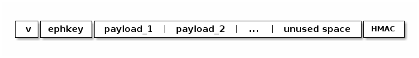
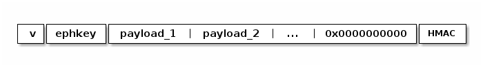
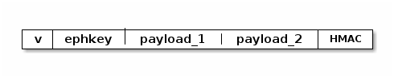

# Table of Contents

1.  [Proposal](#org78d4940)
    1.  [Introduction](#orgd0023b1)
    2.  [Overview](#orgdb755c0)
    3.  [Partial Onion Packet Creation](#orgcaa6be5)
    4.  [Sending a Rendez-vous Payment](#orgce4245c)
    5.  [Processing at the Rendez-vous Node](#orgb7aec92)
    6.  [Signalling](#orgf8a3390)
        1.  [Invoice signalling](#orgeec1817)
        2.  [Rendez-vous node signalling](#orga7e7d24)
    7.  [Common Questions](#org5952639)
        1.  [Why nest the RV onion inside the outer onion and not inline?](#org335c922)
        2.  [Why prefill with a known pseudo-random stream?](#org93dff5e)

# Proposal

## Introduction

Use-cases:

-   Provide recipient-anonymity by hiding the second part of the route in the
    partial onion.
-   Force a payment to go through a specific intermediary. This allows the
    intermediary to witness a payment, or control its resolution. Examples
    of where this might be useful include:
    -   An accountant server gets to witness all payments without any need to
        trust it.
    -   A game server can use rendez-vous invoices to receive two incoming
        payments, hold onto them and release the loser's payment to the winner
        once the game is decided. The winner is masqueraded from both the game
        server as well as the other players.

## Overview

The goal of this proposal is to allow a network participant, to create a
partial onion that can then be completed to a complete onion by a sender that
then describes the entire path from sender to recipient. We will refer to the
sender node as `S`, the recipient as `R` and the node at which the partial
onion starts, and the prepended prefix ends, as rendez-vous node `RV`.

The construction relies on the *partial onion*, which describes the path from
`RV` to `R`, being included as the per-hop payload in the *outer routing
onion* from `S` to `RV`. In order to be able to transfer the partial onion in
the outer onion it will require some preprocessing, since both inner partial
and outer routing onion have a fixed size of 1366 bytes.
The preprocessing consists of generating the partial onion in such a way that
it can be easily compressed, and thus fits into the outer onion's payload.

The general structure of the routing onion is as follows:

The middle part consisting of a number of *payloads* and padded with the
*unused space* is called the routing info. The construction described below
allows the partial onion creator to zero out the unused space, and fill it
with a pseudo-random stream that can easily be generated at `RV`, allowing it
to re-generate the original onion from the compressed representation.

## Partial Onion Packet Creation

The partial onion creator generates an onion like described in
[BOLT04][bolt04]. After initializing the packet with the ChaCha20-based
CSPRNG, some part of the unused space is then re-initialized with a `prefill`
which cancels out the encryption layers applied by each processing node.

In order to zero out the encryption layers that each node would apply to the
partial onion the partial onion creator needs to initialize the part of the
unused space with the `xor` of the stream that each node applies when
processing the onion. This is complicated slightly by the fact that each node
also shifts the packet, meaning that in order for the encryption to cancel out
a different section of the encryption stream needs to be applied. The logic
for this can however be extracted from the [filler
generation][bolt04-filler]. The following code generates the neceassry filler
for the unused space:

    static bool generate_prefill(void *dst, size_t dstlen,
    			     const struct sphinx_path *path,
    			     struct hop_params *params)
    {
    	u8 stream[2 * ROUTING_INFO_SIZE];
    	u8 key[KEY_LEN];
    	size_t fillerStart, fillerSize;
    
    	memset(dst, 0, dstlen);
    	for (int i = 0; i < tal_count(path->hops); i++) {
    		if (!generate_key(&key, RHO_KEYTYPE, strlen(RHO_KEYTYPE),
    				  &params[i].secret))
    			return false;
    
    		generate_cipher_stream(stream, key, sizeof(stream));
    
    		/* Sum up how many bytes have been used by previous hops,
    		 * that gives us the start in the stream */
    		fillerSize = 0;
    		for (int j = 0; j < i; j++)
    			fillerSize += sphinx_hop_size(&path->hops[j]);
    		fillerStart = ROUTING_INFO_SIZE - fillerSize - dstlen;
    
    		/* Apply this hop's prefill */
    		xorbytes(dst, dst, stream + fillerStart, dstlen);
    	}
    	return true;
    }

The main differences to the [filler generation][bolt04-filler] are that the
generated stream always has the same length whereas the filler length depends
on the hop position, and that all hops are generated, unlike the filler which
skips the last hop.

If the unused space is initialized with the resulting prefill stream it is
guaranteed to cancel out the encryption layers and result in a zeroed out
middle part of the partial onion which can then be skipped when serializing.

The length of this prefill can be any range from 0 to the full unused
space. The maximum size of the unused space depends on the effective payload,
i.e., sum of the per-hop payloads and their respective HMACs. A legacy onion
with 5 hops would have an effective payload of 5\*65 bytes, leaving 975 bytes
unused space.

Notice that it is desirable to initialize less than the full unused space in
order to hide the length of the effective payload from `RV`.

After applying this initialization the partial onion would look as follows:

This would be the onion leading from `RV` to `R`, and would also be the onion
that is presented to `RV+1`, i.e., the first node after `RV`. Since this would
leak the information that `RV` was a rendez-vous node to `RV+1` we further
obfuscate the partial onion by also filling it with a ChaCha20 stream.  For
this purpose the partial onion creator generates a key using the [key
generation algorithm][key-gen], the `ephkey` from the partial onion and the
key type `prefill` (`0x70726566696c6c`). This key is then used to generate a
ChaCha20 stream matching the prefill-length, and applied via `xor` to the
prefill. The result is a partial onion which, once fully wrapped, has the
ChaCha20 stream in the place of the prefill.

The partial onion is then compressed by simply omitting the prefill, since
that can be re-generated at `RV` once it processes the payment.

[bolt04]: <https://github.com/lightningnetwork/lightning-rfc/blob/master/04-onion-routing.md>
[bolt04-filler]: <https://github.com/lightningnetwork/lightning-rfc/blob/master/04-onion-routing.md#filler-generation>
[key-gen]: <https://github.com/lightningnetwork/lightning-rfc/blob/master/04-onion-routing.md#key-generation>

## Sending a Rendez-vous Payment

Upon receiving a partial onion the sender `S` creates the outer onion,
carrying the payment and the partial onion from itself to the rendez-vous node
`RV`. This is achieved by searching for a path from `S` to `RV`, building
the outer onion, and including the partial onion in the per-hop payload
destined for `RV`.

## Processing at the Rendez-vous Node

Upon receiving an incoming HTLC and associated onion `RV` extracts its
payload. If the payload contains a compressed it splits off the HMAC at the
end, computes how many bytes it needs to prefill, and generates the prefill
key using the included ephemeral key `ephkey` (not the ephemeral key from the
outer onion).

The prefill is then used to complete the partial onion, and the partial onion
can be serialized and forwarded to the next hop.

## Signalling

### Invoice signalling

### Rendez-vous node signalling

## Common Questions

### Why nest the RV onion inside the outer onion and not inline?

With a similar construction it could be possible to amend the incoming onion
in such a way that it becomes a valid onion for the send part of the path, and
swapping out the ephemeral key. This is what the [previous proposal][prev] was
trying to achieve, however the nesting method is simpler to implement and
has the same space requirements. It is possible to have the sender stash the
partial onion in the unused space in the outer onion and then having `RV`
overwrite the tail of the incoming onion with the stream, but it is slightly
more awkward.

[prev]: <https://github.com/lightningnetwork/lightning-rfc/wiki/Rendez-vous-mechanism-on-top-of-Sphinx>

### Why prefill with a known pseudo-random stream?

We want to hide the fact that `RV` was a rendez-vous node from `RV+1`, hence
we can't leave the prefill zeroed out.Instead of generating the prefill in
such a way that the partial onion contains a pseudo-random stream we could
just zero it out and then re-process the onion as if `RV` were in the route
twice. However having the partial onion creator generate the prefill with the
pseudo-random stream seems like a better tradeoff with respect to
computational load on `RV`.

